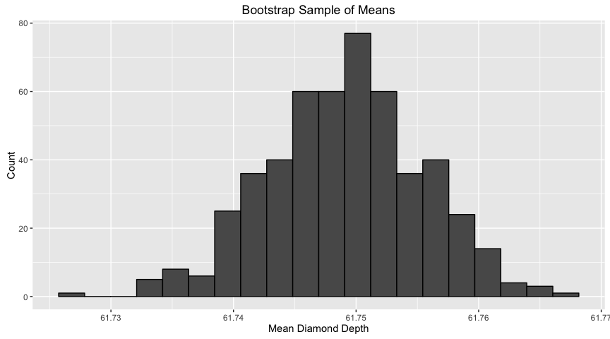

Spark MLlib: Bootstrapping
================

In this article, we demonstrate how you might use `sdf_sample`, alongside the `dplyr` interface provided by `sparklyr`, to compute bootstrapped estimates of a statistic. To keep things simple, we'll focus on computation of the mean for the `diamonds` dataset, but this could expand to any other statistic you might want to compute using `sparklyr` and Spark.

First, we load the `diamonds` dataset, and copy it into Spark.

``` r
library(sparkapi)
library(sparklyr)
library(dplyr)
library(ggplot2)

data(diamonds, package = "ggplot2")

sc <- spark_connect(master = "local", version = "1.6.1")
diamonds_tbl <- copy_to(sc, diamonds, "diamonds", overwrite = TRUE)
diamonds_sdf <- sparkapi_dataframe(diamonds_tbl)
```

Next, we compute our bootstrap estimates of the mean. Note that all of the computational sampling work is occurring on the Spark side; only the computed statistic is returned to the R session on each bootstrap iteration.

``` r
n <- 500 # number of bootstrap samples
estimates <- replicate(n, simplify = "list", {
  name <- "sampled"
  diamonds_sdf %>%
    sdf_sample(replacement = TRUE) %>%       # take a random sample with replacement
    sdf_register(name = name) %>%            # register our Spark DataFrame
    summarize(statistic = mean(depth)) %>%   # compute the mean
    collect() %>%                            # collect results back to R
    .[["statistic"]]                         # extract our statistic
})
```

Finally, we plot a histogram of our bootstrapped means.

``` r
df <- data.frame(estimates = estimates)
ggplot(df, aes(x = estimates)) +
  geom_histogram(bins = 20, col = "black") +
  labs(
    x = "Mean Diamond Depth",
    y = "Count",
    title = "Bootstrap Sample of Means"
  )
```


