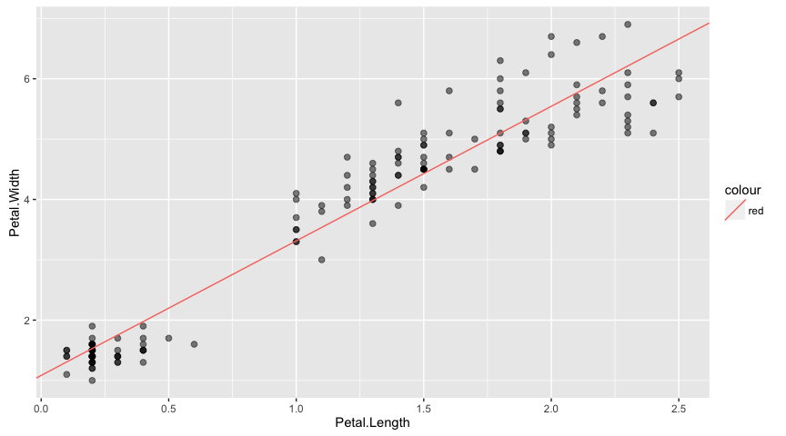

RSpark ML: Examples
================

Initialization
--------------

``` r
library(rspark)
library(dplyr)
```

    ## 
    ## Attaching package: 'dplyr'

    ## The following objects are masked from 'package:stats':
    ## 
    ##     filter, lag

    ## The following objects are masked from 'package:base':
    ## 
    ##     intersect, setdiff, setequal, union

``` r
library(ggplot2)
```

    ## Warning: package 'ggplot2' was built under R version 3.2.4

``` r
sc <- spark_connect("local", cores = "auto", version = "2.0.0-preview")
db <- src_spark(sc)

copy_to(db, iris, "iris")
```

KMeans in R
-----------

``` r
cl <- iris %>%
  select(Petal.Width, Petal.Length) %>%
  kmeans(3)

centers <- as.data.frame(cl$centers)

iris %>%
  select(Petal.Width, Petal.Length) %>%
  ggplot(aes(x=Petal.Length, y=Petal.Width)) +
    geom_point(data=centers, aes(x=Petal.Width,y=Petal.Length), size=60, alpha=0.1) +
    geom_point(data=iris, aes(x=Petal.Width,y=Petal.Length), size=2, alpha=0.5)
```


KMeans in RSpark
----------------

Basing kmeans over Spark on [spark.mllib K-means](http://spark.apache.org/docs/latest/mllib-clustering.html#k-means)

``` r
model <- tbl(db, "iris") %>%
  select(Petal_Width, Petal_Length) %>%
  ml_kmeans(3)

tbl(db, "iris") %>%
  select(Petal_Width, Petal_Length) %>%
  collect %>%
  ggplot(aes(x=Petal_Length, y=Petal_Width)) +
    geom_point(data=model$centers, aes(x=Petal_Width,y=Petal_Length), size=60, alpha=0.1) +
    geom_point(aes(x=Petal_Width,y=Petal_Length), size=2, alpha=0.5)
```



Linear Model in R
-----------------

``` r
data <- iris %>%
  select(Petal.Width, Petal.Length)

model <- lm(Petal.Length ~ Petal.Width, data = iris)

iris %>%
  select(Petal.Width, Petal.Length) %>%
  ggplot(aes(x = Petal.Length, y = Petal.Width)) +
    geom_point(data = iris, aes(x = Petal.Width, y = Petal.Length), size=2, alpha=0.5) +
    geom_abline(aes(slope = coef(model)[["Petal.Width"]],
                    intercept = coef(model)[["(Intercept)"]],
                    color="red"))
```


Linear Model in RRspark
-----------------------

``` r
model <- tbl(db, "iris") %>%
  select(Petal_Width, Petal_Length) %>%
  ml_lm(response = "Petal_Length", features = c("Petal_Width"))

iris %>%
  select(Petal.Width, Petal.Length) %>%
  ggplot(aes(x = Petal.Length, y = Petal.Width)) +
    geom_point(data = iris, aes(x = Petal.Width, y = Petal.Length), size=2, alpha=0.5) +
    geom_abline(aes(slope = coef(model)[["Petal_Width"]],
                    intercept = coef(model)[["(Intercept)"]],
                    color="red"))
```


Cleanup
-------

``` r
spark_disconnect(sc)
```
