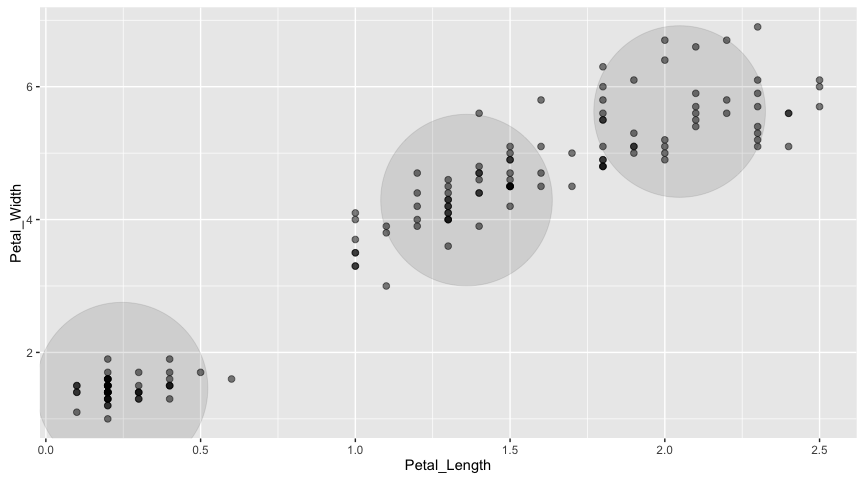

RSpark ML: Examples
================

Initialization
--------------

``` r
library(rspark)
library(dplyr)
```

    ## 
    ## Attaching package: 'dplyr'

    ## The following objects are masked from 'package:stats':
    ## 
    ##     filter, lag

    ## The following objects are masked from 'package:base':
    ## 
    ##     intersect, setdiff, setequal, union

``` r
library(ggplot2)

sc <- spark_connect("local", cores = "auto", version = "2.0.0-preview")
db <- src_spark(sc)

copy_to(db, iris, "iris")
```

KMeans in R
-----------

``` r
cl <- iris %>%
  select(Petal.Width, Petal.Length) %>%
  kmeans(3)

centers <- as.data.frame(cl$centers)

iris %>%
  select(Petal.Width, Petal.Length) %>%
  ggplot(aes(x=Petal.Length, y=Petal.Width)) +
    geom_point(data=centers, aes(x=Petal.Width,y=Petal.Length), size=60, alpha=0.1) +
    geom_point(data=iris, aes(x=Petal.Width,y=Petal.Length), size=2, alpha=0.5)
```



KMeans in RSpark
----------------

Basing kmeans over Spark on [spark.mllib K-means](http://spark.apache.org/docs/latest/mllib-clustering.html#k-means)

``` r
model <- tbl(db, "iris") %>%
  select(Petal_Width, Petal_Length) %>%
  ml_kmeans(3)

tbl(db, "iris") %>%
  select(Petal_Width, Petal_Length) %>%
  collect %>%
  ggplot(aes(x=Petal_Length, y=Petal_Width)) +
    geom_point(data=model$centers, aes(x=Petal_Width,y=Petal_Length), size=60, alpha=0.1) +
    geom_point(aes(x=Petal_Width,y=Petal_Length), size=2, alpha=0.5)
```


Linear Regression in R
----------------------

``` r
data <- iris %>%
  select(Petal.Width, Petal.Length)

model <- lm(Petal.Length ~ Petal.Width, data = iris)

iris %>%
  select(Petal.Width, Petal.Length) %>%
  ggplot(aes(x = Petal.Length, y = Petal.Width)) +
    geom_point(data = iris, aes(x = Petal.Width, y = Petal.Length), size=2, alpha=0.5) +
    geom_abline(aes(slope = coef(model)[["Petal.Width"]],
                    intercept = coef(model)[["(Intercept)"]],
                    color="red"))
```


Linear Regression in RSpark
---------------------------

``` r
model <- tbl(db, "iris") %>%
  select(Petal_Width, Petal_Length) %>%
  ml_lm(response = "Petal_Length", features = c("Petal_Width"))

iris %>%
  select(Petal.Width, Petal.Length) %>%
  ggplot(aes(x = Petal.Length, y = Petal.Width)) +
    geom_point(data = iris, aes(x = Petal.Width, y = Petal.Length), size=2, alpha=0.5) +
    geom_abline(aes(slope = coef(model)[["Petal_Width"]],
                    intercept = coef(model)[["(Intercept)"]],
                    color="red"))
```


Principal Components Analysis in R
----------------------------------

``` r
iris %>%
  select(-Species) %>%
  prcomp(center = FALSE, scale = FALSE)
```

    ## Standard deviations:
    ## [1] 7.8613425 1.4550406 0.2835305 0.1544110
    ## 
    ## Rotation:
    ##                     PC1        PC2         PC3        PC4
    ## Sepal.Length -0.7511082  0.2841749  0.50215472  0.3208143
    ## Sepal.Width  -0.3800862  0.5467445 -0.67524332 -0.3172561
    ## Petal.Length -0.5130089 -0.7086646 -0.05916621 -0.4807451
    ## Petal.Width  -0.1679075 -0.3436708 -0.53701625  0.7518717

Principal Components Analysis in RSpark
---------------------------------------

``` r
model <- tbl(db, "iris") %>%
  select(-Species) %>%
  ml_pca()
print(model)
```

    ## $components
    ##                     [,1]        [,2]        [,3]       [,4]
    ## Sepal_Length -0.36138659 -0.65658877  0.58202985  0.3154872
    ## Sepal_Width   0.08452251 -0.73016143 -0.59791083 -0.3197231
    ## Petal_Length -0.85667061  0.17337266 -0.07623608 -0.4798390
    ## Petal_Width  -0.35828920  0.07548102 -0.54583143  0.7536574
    ## 
    ## $explained.variance
    ## Sepal_Length  Sepal_Width Petal_Length  Petal_Width 
    ##  0.924618723  0.053066483  0.017102610  0.005212184

Cleanup
-------

``` r
spark_disconnect(sc)
```
