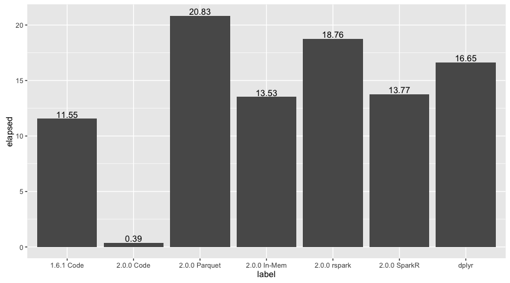

RSpark Performance: 1B Rows
================

Setup
-----

``` r
rspark:::spark_install(version = "2.0.0-SNAPSHOT", reset = TRUE, logging = "WARN")
```

Initialization
--------------

``` r
library(rspark)
library(magrittr)
library(dplyr)
```

    ## 
    ## Attaching package: 'dplyr'

    ## The following objects are masked from 'package:stats':
    ## 
    ##     filter, lag

    ## The following objects are masked from 'package:base':
    ## 
    ##     intersect, setdiff, setequal, union

``` r
library(ggplot2)
```

    ## Warning: package 'ggplot2' was built under R version 3.2.4

``` r
sc <- spark_connect(master = "local", version = "2.0.0-preview", memory = "4G")
db <- src_spark(sc)
ses <- rspark:::spark_sql_or_hive(db$con@api)
parquetPath <- file.path(getwd(), "billion.parquet")

if (!file.exists(parquetPath)) {
  billion <- spark_invoke_static_ctor(sc, "java.math.BigInteger", "1000000000") %>%
    spark_invoke("longValue")
  
  ses %>%
    spark_invoke("range", as.integer(billion)) %>%
    spark_invoke("toDF") %>%
    spark_invoke("write") %>%
    spark_invoke("save", "billion.parquet")
}

invisible(
  load_parquet(db, "billion", parquetPath)
)

spark_conf <- function(ses, config, value) {
  ses %>%
    spark_invoke("conf") %>%
    spark_invoke("set", config, value)
}

spark_sum_range <- function(sc, ses) {
  billion <- spark_invoke_static_ctor(sc, "java.math.BigInteger", "1000000000") %>%
    spark_invoke("longValue")
  
  result <- ses %>%
    spark_invoke("range", as.integer(billion)) %>%
    spark_invoke("toDF", list("x")) %>%
    spark_invoke("selectExpr", list("sum(x)"))
    
  spark_invoke(result, "collect")[[1]]
}

spark_sum_range_mem <- function(ses) {
  ses %>%
    spark_invoke("table", "billion") %>%
    spark_invoke("selectExpr", list("sum(x)")) %>%
    spark_invoke("collect")
}

spark_sum_range_dplyr <- function(db) {
  tbl(db, "billion") %>%
    summarise(total = sum(x)) %>%
    collect
}

spark_sum_range_sparkr_prepare <- function(sc) {
  Sys.setenv(SPARK_HOME = sc$installInfo$sparkVersionDir)
  library(SparkR, lib.loc = c(file.path(Sys.getenv("SPARK_HOME"), "R", "lib")))
  scR <- sparkR.init(master = "local[*]", sparkEnvir = list(spark.driver.memory="8G"))
  sqlContextR <- sparkRSQL.init(scR)
  
  df <- loadDF(sqlContextR, parquetPath, "parquet")
  registerTempTable(df, "billion")
  
  sql(sqlContextR, "CACHE TABLE billion")
  collect(sql(sqlContextR, "SELECT count(*) FROM billion"))
  
  sqlContextR
}

spark_sum_range_sparkr <- function(sqlContextR) {
  collect(sql(sqlContextR, "SELECT sum(*) FROM billion"))
}

spark_sum_range_sparkr_terminate <- function() {
  detach(name = "package:SparkR")
}
```

Spark 1.0
---------

``` r
logResults <- function(label, test) {
  runTime <- system.time({
    sum <- test()
  })
  
  as.data.frame(list(
    label = label,
    time = runTime[[3]],
    sum = sum))
}

run1 <- logResults("1.6.1 Code", function() {
  spark_conf(ses, "spark.sql.codegen.wholeStage", "false")
  spark_sum_range(sc, ses)
})

run2 <- logResults("2.0.0 Code", function() {
  spark_conf(ses, "spark.sql.codegen.wholeStage", "true")
  spark_sum_range(sc, ses)
})

run3 <- logResults("2.0.0 In-Mem", function() {
  spark_conf(ses, "spark.sql.codegen.wholeStage", "true")
  sum <- spark_sum_range_mem(ses)
})

run4 <- logResults("2.0.0 rspark", function() {
  spark_conf(ses, "spark.sql.codegen.wholeStage", "true")
  sum <- spark_sum_range_dplyr(db)
})

sparkRContext <- spark_sum_range_sparkr_prepare(sc)
```

    ## 
    ## Attaching package: 'SparkR'

    ## The following objects are masked from 'package:dplyr':
    ## 
    ##     arrange, between, collect, contains, count, cume_dist,
    ##     dense_rank, desc, distinct, explain, filter, first, group_by,
    ##     intersect, lag, last, lead, mutate, n, n_distinct, ntile,
    ##     percent_rank, rename, row_number, sample_frac, select, sql,
    ##     summarize

    ## The following objects are masked from 'package:stats':
    ## 
    ##     cov, filter, lag, na.omit, predict, sd, var, window

    ## The following objects are masked from 'package:base':
    ## 
    ##     as.data.frame, colnames, colnames<-, drop, intersect, rank,
    ##     rbind, sample, subset, summary, transform

    ## Launching java with spark-submit command /Users/javierluraschi/Library/Caches/spark/spark-2.0.0-preview-bin-hadoop2.6/bin/spark-submit   --driver-memory "8G" sparkr-shell /var/folders/fz/v6wfsg2x1fb1rw4f6r0x4jwm0000gn/T//RtmpjfsLPD/backend_port3bee7e16ec58

``` r
run5 <- logResults("2.0.0 SparkR", function() {
  sum <- spark_sum_range_sparkr(sparkRContext)
})
spark_sum_range_sparkr_terminate()

allRuns <- lapply(list(run1, run2, run3, run4, run5), function(e) {
  colnames(e) <- c("label", "elapsed", "sum")
  e
})
results <- do.call("rbind", allRuns)

results %>% 
  ggplot(aes(label, elapsed)) +
  geom_bar(stat = "identity") +
  geom_text(aes(label = round(elapsed, 2)), vjust = -0.2)
```



Cleanup
=======

``` r
spark_disconnect(sc)
```
