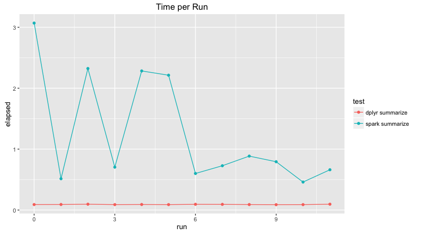
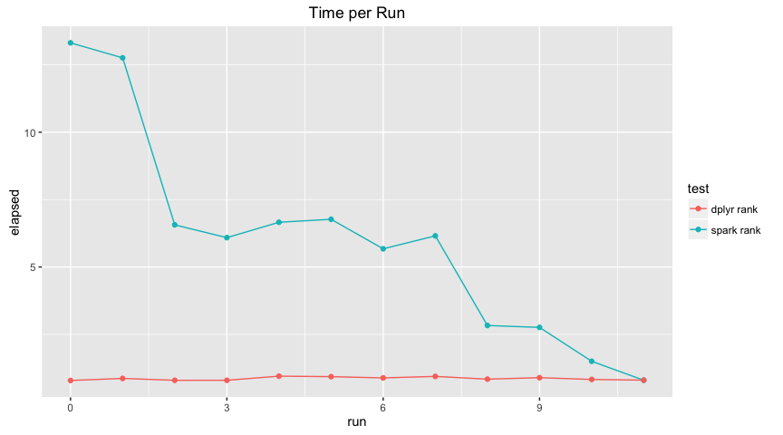

Performance Benchmark
================

Initialization
--------------

``` r
knitr::opts_chunk$set(warning = FALSE, cache = FALSE)
library(spark)
library(dplyr)
```

    ## 
    ## Attaching package: 'dplyr'

    ## The following objects are masked from 'package:stats':
    ## 
    ##     filter, lag

    ## The following objects are masked from 'package:base':
    ## 
    ##     intersect, setdiff, setequal, union

``` r
library(reshape2)
library(ggplot2)
```

    ## Warning: package 'ggplot2' was built under R version 3.2.4

``` r
summarize_delay <- function(source) {
  source %>%
    group_by(tailnum) %>%
    summarise(count = n(), dist = mean(distance), delay = mean(arr_delay)) %>%
    filter(count > 20, dist < 2000)
}

top_players <- function(source) {
  source %>%
    select(playerID, yearID, teamID, G, AB:H) %>%
    arrange(playerID, yearID, teamID) %>%
    group_by(playerID) %>%
    filter(min_rank(desc(H)) <= 2 & H > 0)
}

top_players_by_run <- function(source) {
  source %>%
    select(playerID, yearID, teamID, G, AB:H) %>%
    arrange(playerID, yearID, teamID) %>%
    group_by(playerID) %>%
    filter(min_rank(desc(R)) <= 2 & R > 0)
}
```

``` r
spark_perf_test <- function(params, tests) {
  resultsList <- lapply(params, function(param) {
    spark_install(version = param$version, reset = TRUE, logging = param$logging)
    
    sc <- spark_connect(master = param$master,
                        version = param$version,
                        cores = param$cores)
    
    db <- src_spark(sc)
    
    copy_to(db,
            nycflights13::flights,
            "flights",
            cache = param$cache,
            repartition = param$partitions)
    
    copy_to(db,
            Lahman::Batting,
            "batting",
            cache = param$cache,
            repartition = param$partitions)
    
    sources <- list(
      flights = tbl(db, "flights"),
      batting = tbl(db, "batting")
    )
    
    testResults <- lapply(seq_along(tests), function(testNames, testNum) {
      test <-  tests[[testNum]]
      testName <- names(tests)[[testNum]]
      
      unname(c(
        lapply(param, function(e) if (is.null(e)) NA else e),
        list(
          test = testName,
          elapsed = system.time(test(db, sources))[["elapsed"]]
        )
      ))
    }, testNames = names(tests))
    
    spark_disconnect(sc)
    
    testResults
  })
  
  columnNames <- c(names(params[[1]]), list("test", "elapsed"))
  
  resultsDF <- do.call(rbind.data.frame, unlist(resultsList, recursive = FALSE))
  #resultsDF <- data.frame(do.call(rbind, unlist(resultsList, recursive = FALSE)))
  
  colnames(resultsDF) <- columnNames
  
  resultsDF
}
```

``` r
spark_perf_single_test <- function(runResults, master, version, logging, cache, partitions, cores) {
  run <- length(runResults)
  
  c(
    runResults,
    list(
      spark_perf_test(
        params = list(
          list(
            run = run,
            master = master,
            version = version,
            logging = logging,
            cache = cache,
            partitions = partitions,
            cores = cores
          )
        ),
        tests = list(
          `spark summarize` = function(db, sources) {
            sources$flights %>% summarize_delay %>% head
          },
          `dplyr summarize` = function(db, sources) {
            nycflights13::flights %>% summarize_delay %>% head
          },
          `spark rank` = function(db, sources) {
            sources$batting %>% top_players %>% head
          },
          `dplyr rank` = function(db, sources) {
            Lahman::Batting %>% top_players %>% head
          },
          `spark warm` = function(db, sources) {
            sources$batting %>% top_players_by_run %>% head
          },
          `dplyr warm` = function(db, sources) {
            Lahman::Batting %>% top_players_by_run %>% head
          }
        )
      )
    )
  )
}
```

Results
-------

``` r
runResults <- list()

runResults <- spark_perf_single_test(runResults, "local", "1.6.0", "INFO", FALSE, 0, 0)
runResults <- spark_perf_single_test(runResults, "local", "1.6.0", "INFO", TRUE, 0, 0)
runResults <- spark_perf_single_test(runResults, "local", "2.0.0", "INFO", FALSE, 0, 0)
runResults <- spark_perf_single_test(runResults, "local", "2.0.0", "INFO", TRUE, 0, 0)
runResults <- spark_perf_single_test(runResults, "local[*]", "1.6.0", "INFO", FALSE, 0, 0)
runResults <- spark_perf_single_test(runResults, "local[*]", "1.6.0", "WARN", FALSE, 0, 0)
runResults <- spark_perf_single_test(runResults, "local[*]", "1.6.0", "WARN", TRUE, 0, 0)
runResults <- spark_perf_single_test(runResults, "local[*]", "1.6.0", "WARN", TRUE, 8, 0)
runResults <- spark_perf_single_test(runResults, "local[*]", "2.0.0", "WARN", TRUE, 8, 0)
runResults <- spark_perf_single_test(runResults, "local[*]", "2.0.0", "WARN", TRUE, 0, 0)
runResults <- spark_perf_single_test(runResults, "local[*]", "1.6.0", "WARN", TRUE, 0, NULL)
runResults <- spark_perf_single_test(runResults, "local[*]", "2.0.0", "WARN", TRUE, 0, NULL)

results <- do.call("rbind", runResults)

results <- results %>% 
  mutate(params = paste(run, master, version, cache, logging, partitions))
```

``` r
results %>%
  filter(test == "spark summarize" | test == "dplyr summarize") %>%
  rename(part = partitions) %>%
  dcast(run + master + version + logging + part + cores ~ test, value.var = "elapsed")
```

    ##    run   master version logging part cores dplyr summarize spark summarize
    ## 1    0    local   1.6.0    INFO    0     0           0.087           3.042
    ## 2    1    local   1.6.0    INFO    0     0           0.089           0.517
    ## 3    2    local   2.0.0    INFO    0     0           0.088           2.086
    ## 4    3    local   2.0.0    INFO    0     0           0.082           0.659
    ## 5    4 local[*]   1.6.0    INFO    0     0           0.083           2.207
    ## 6    5 local[*]   1.6.0    WARN    0     0           0.085           2.250
    ## 7    6 local[*]   1.6.0    WARN    0     0           0.092           0.606
    ## 8    7 local[*]   1.6.0    WARN    8     0           0.086           0.791
    ## 9    8 local[*]   2.0.0    WARN    8     0           0.087           0.770
    ## 10   9 local[*]   2.0.0    WARN    0     0           0.086           0.776
    ## 11  10 local[*]   1.6.0    WARN    0    NA           0.090           0.506
    ## 12  11 local[*]   2.0.0    WARN    0    NA           0.085           0.620

``` r
results %>%
  filter(test == "spark rank" | test == "dplyr rank") %>%
  rename(part = partitions) %>%
  dcast(run + master + version + logging + part + cores ~ test, value.var = "elapsed")
```

    ##    run   master version logging part cores dplyr rank spark rank
    ## 1    0    local   1.6.0    INFO    0     0      0.792     13.196
    ## 2    1    local   1.6.0    INFO    0     0      0.762     12.201
    ## 3    2    local   2.0.0    INFO    0     0      0.748      6.469
    ## 4    3    local   2.0.0    INFO    0     0      0.780      5.987
    ## 5    4 local[*]   1.6.0    INFO    0     0      0.888      6.224
    ## 6    5 local[*]   1.6.0    WARN    0     0      0.865      6.161
    ## 7    6 local[*]   1.6.0    WARN    0     0      0.918      5.675
    ## 8    7 local[*]   1.6.0    WARN    8     0      0.907      6.066
    ## 9    8 local[*]   2.0.0    WARN    8     0      0.819      2.894
    ## 10   9 local[*]   2.0.0    WARN    0     0      0.849      2.892
    ## 11  10 local[*]   1.6.0    WARN    0    NA      0.783      1.441
    ## 12  11 local[*]   2.0.0    WARN    0    NA      0.739      0.837

``` r
results %>%
  filter(test == "spark warm" | test == "dplyr warm") %>%
  rename(part = partitions) %>%
  dcast(run + master + version + logging + part + cores ~ test, value.var = "elapsed")
```

    ##    run   master version logging part cores dplyr warm spark warm
    ## 1    0    local   1.6.0    INFO    0     0      0.798     11.824
    ## 2    1    local   1.6.0    INFO    0     0      0.740     10.794
    ## 3    2    local   2.0.0    INFO    0     0      0.747      5.478
    ## 4    3    local   2.0.0    INFO    0     0      0.754      5.146
    ## 5    4 local[*]   1.6.0    INFO    0     0      0.903      4.719
    ## 6    5 local[*]   1.6.0    WARN    0     0      0.850      4.743
    ## 7    6 local[*]   1.6.0    WARN    0     0      0.952      4.364
    ## 8    7 local[*]   1.6.0    WARN    8     0      0.895      4.618
    ## 9    8 local[*]   2.0.0    WARN    8     0      0.803      2.437
    ## 10   9 local[*]   2.0.0    WARN    0     0      0.844      2.275
    ## 11  10 local[*]   1.6.0    WARN    0    NA      0.772      0.551
    ## 12  11 local[*]   2.0.0    WARN    0    NA      0.744      0.460

``` r
results %>%
  filter(test != "dplyr summarize" | test != "spark summarize") %>%
  ggplot(aes(test, params)) + 
    geom_tile(aes(fill = elapsed), colour = "white") +
    scale_fill_gradient(low = "steelblue", high = "black") +
    theme(axis.text.x=element_text(angle=330, hjust = 0))
```


``` r
results %>%
  filter(test == "dplyr summarize" | test == "spark summarize") %>%
  ggplot(aes(x=run, y=elapsed, group = test, color = test)) + 
    geom_line() + geom_point() +
    ggtitle("Time per Run")
```



``` r
results %>%
  filter(test == "dplyr rank" | test == "spark rank") %>%
  ggplot(aes(x=run, y=elapsed, group = test, color = test)) + 
    geom_line() + geom_point() +
    ggtitle("Time per Run")
```



``` r
results %>%
  filter(test == "dplyr warm" | test == "spark warm") %>%
  ggplot(aes(x=run, y=elapsed, group = test, color = test)) + 
    geom_line() + geom_point() +
    ggtitle("Time per Run")
```


